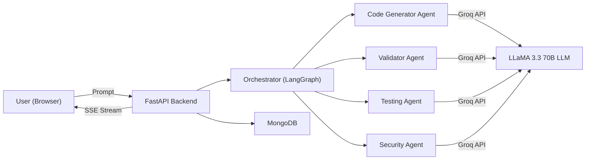
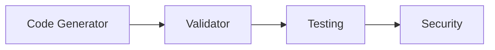
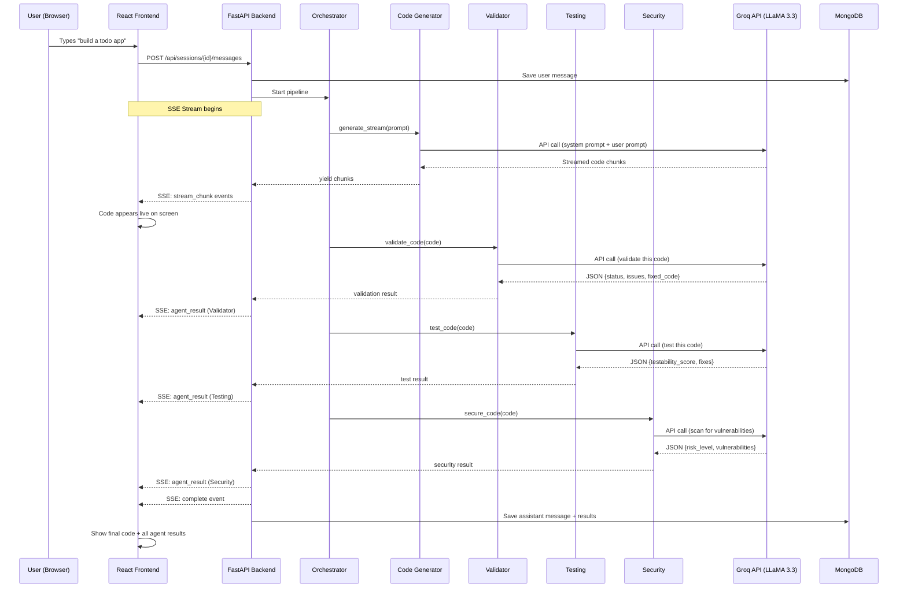

# 🚀 Uber Code Generator — Complete Project Explanation

> An **AI-powered multi-agent code generation platform** that takes a natural language prompt, generates production-ready code, and automatically validates, tests, and secures it — all in real-time with a live streaming UI.

---

## 1. High-Level Architecture



### How it works (in one paragraph):

The user types a prompt like *"create a todo app in React"*. The **React frontend** sends this to the **FastAPI backend** via HTTP POST. The backend creates a **Server-Sent Events (SSE) stream** and passes the prompt to the **Orchestrator**. The Orchestrator runs **4 AI agents sequentially** (Code Generator → Validator → Testing → Security), each calling the **Groq API** (LLaMA 3.3 70B model). The generated code is **streamed in real-time** to the frontend, while each agent's results (fixes, issues, scores) are sent as separate SSE events. The frontend renders everything live — code appears character-by-character, workflow steps animate, and agent results populate dynamically.

---

## 2. Technology Stack

| Layer | Technology | Purpose |
|-------|-----------|---------|
| **Frontend** | React 18 | Single-page application UI |
| **Backend** | FastAPI (Python) | REST API + SSE streaming server |
| **Database** | MongoDB + Motor | Async NoSQL storage for sessions, messages, users |
| **AI/LLM** | Groq API + LLaMA 3.3 70B | AI model for code generation & analysis |
| **Orchestration** | NetworkX (graph library) | LangGraph-style DAG workflow for agent coordination |
| **Auth** | Google OAuth 2.0 + JWT | User authentication |
| **ASGI Server** | Uvicorn | High-performance async server |

---

## 3. Project File Structure

```
Uber-Code-Generator-master/
│
├── main.py                  # FastAPI app, API routes, SSE streaming
├── orchestrator.py          # LangGraph-style workflow orchestrator
├── config.py                # Environment variable management
├── database.py              # MongoDB models & operations
├── auth.py                  # Google OAuth + JWT authentication
├── agui_protocol.py         # AG-UI Protocol (Generative UI specs)
├── requirements.txt         # Python dependencies
├── .env                     # API keys & config (secret)
│
├── agents/                  # AI Agent modules
│   ├── __init__.py          # Agent exports & registry
│   ├── base.py              # Base agent class (Groq API call)
│   ├── code_generator.py    # Code generation agent
│   ├── validator.py         # Code validation/quality agent
│   ├── testing.py           # Testing & error-handling agent
│   └── security.py          # Security vulnerability agent
│
└── frontend/                # React frontend
    └── src/
        ├── App.js           # Router & providers
        ├── index.js         # React entry point
        ├── context/
        │   └── AuthContext.js       # Auth state management
        ├── pages/
        │   ├── LandingPage.js       # Home/marketing page
        │   ├── LoginPage.js         # Google sign-in page
        │   ├── DashboardPage.js     # User dashboard
        │   └── GenUIChatPageV2.js   # Main chat + code gen page (★ core)
        ├── components/
        │   ├── GenUIComponents.js   # Reusable UI component library
        │   ├── TabbedCodeBlock.js   # Multi-file code viewer with tabs
        │   ├── AGUIRenderer.js      # Renders AG-UI protocol specs
        │   ├── SetupGuide.js        # Project setup instructions
        │   ├── Toast.js             # Notification toasts
        │   └── ... (20+ more)
        └── utils/
            └── parseCodeFiles.js    # Splits multi-file code output
```

---

## 4. Backend Files — Explained in Detail

### 4.1 `main.py` — The Heart of the Backend

**What it does:** This is the entry point. It creates the FastAPI application, defines all API routes, and handles the **real-time streaming pipeline**.

**Key components:**

| Function/Route | Purpose |
|---------------|---------|
| `@app.post("/api/sessions/{id}/messages")` | Main endpoint — receives a prompt, starts the SSE stream |
| `generate_code_stream()` | The core generator function that orchestrates the entire pipeline |
| `@app.post("/api/edit")` | Re-runs agents on modified code |
| `@app.post("/api/sessions")` | Creates a new chat session |
| `@app.get("/api/sessions")` | Lists user's chat sessions |

**The Streaming Pipeline (inside `generate_code_stream()`):**

```
1. User sends prompt
2. ⚡ CODE GENERATOR PHASE
   - Streams code chunks via SSE → frontend shows code appearing live
   - Strips markdown fences (```python) from output
3. 🔍 Smart Agent Skipping
   - Analyzes generated code to decide which agents to skip
   - E.g., pure HTML/CSS → skip Testing agent
4. ✓ VALIDATOR PHASE
   - Validates code quality, syntax, best practices
   - If fixes found → updates current_code
5. 🧪 TESTING PHASE (if needed)
   - Checks error handling, edge cases, testability
   - May add try/catch blocks, input validation
6. 🛡️ SECURITY PHASE (if needed)
   - Scans for vulnerabilities (XSS, SQL injection, etc.)
   - May fix dangerous patterns
7. ✅ COMPLETE → sends final result with all fixes
```

**SSE (Server-Sent Events) explained:**
Instead of a single HTTP response, the server keeps the connection open and sends events one at a time. The frontend receives each event and updates the UI in real-time. Event types include:
- `stream_chunk` — a piece of generated code
- `agent_start` — an agent begins working
- `agent_result` — an agent finished with results
- `workflow_update` — step status changed
- `code_update` — code was modified by an agent
- `complete` — everything is done

---

### 4.2 `orchestrator.py` — The Brain (LangGraph Workflow)

**What it does:** Coordinates all 4 AI agents using a **Directed Acyclic Graph (DAG)** workflow, inspired by LangGraph.

**Key concepts:**



| Method | Purpose |
|--------|---------|
| `_build_workflow_graph()` | Creates the DAG using NetworkX: `Generator → Validator → Tester → Security` |
| `generate_code_stream()` | Calls the code generator with streaming (yields chunks) |
| `validate_code()` | Runs the validator agent on the code |
| `test_code()` | Runs the testing agent on the code |
| `secure_code()` | Runs the security agent on the code |
| `determine_required_agents()` | Smart skipping — analyzes code to decide which agents are needed |
| `generate_code()` | Non-streaming code generation |

**Smart Agent Skipping logic:**
- **Validator** → Always runs (never skipped)
- **Testing** → Skipped for pure HTML/CSS or very short scripts (<5 lines)
- **Security** → Skipped for static content with no user input, no backend, no API/DB usage

---

### 4.3 `agents/base.py` — Base Agent Class

**What it does:** Provides the shared foundation for all 4 agents.

| Component | Purpose |
|-----------|---------|
| `call_groq_api()` | Sends HTTP POST to Groq API with system prompt + user prompt |
| `BaseAgent` class | Parent class — holds API key, provides `call_api()` and `parse_json_response()` |
| `parse_json_response()` | Robust JSON parser with 3 fallback strategies (direct parse → cleanup → regex extraction) |

**API call structure:**
```python
POST https://api.groq.com/openai/v1/chat/completions
{
    "model": "llama-3.3-70b-versatile",
    "messages": [
        {"role": "system", "content": "<agent's system prompt>"},
        {"role": "user", "content": "<code or prompt>"}
    ],
    "temperature": 0.3,
    "max_tokens": 2000
}
```

---

### 4.4 The 4 AI Agents

Each agent extends `BaseAgent` and has a specialized **system prompt** telling the LLM how to behave.

#### 🔵 `code_generator.py` — Code Generator Agent
- **Input:** Natural language prompt (e.g., "build a calculator")
- **Output:** Raw source code (single file or multi-file project)
- **System prompt rules:**
  - Multi-file projects use `<!-- path/file.ext -->` markers
  - Minimum 10 files for apps/projects
  - No markdown fences in output
  - Minimal comments (single-line only)
- **Special methods:**
  - `generate()` — non-streaming, returns full code
  - `generate_stream()` — yields code chunks for real-time streaming
  - `_strip_markdown_fences()` — removes ````python` etc.

#### 🟢 `validator.py` — Validation Agent
- **Input:** Generated code
- **Output:** JSON with `status`, `issues`, `fixes_applied`, `fixed_code`
- **What it checks:** Syntax errors, code style, best practices, structural issues
- **Returns fixed code** if issues found

#### 🟡 `testing.py` — Testing Agent
- **Input:** Code to analyze
- **Output:** JSON with `testability_score`, `issues_found`, `fixes_applied`, `fixed_code`
- **What it checks:** Error handling, edge cases, input validation, missing try/catch blocks
- **May add:** Error handling code, input validation, defensive programming patterns

#### 🔴 `security.py` — Security Agent
- **Input:** Code to scan
- **Output:** JSON with `risk_level`, `vulnerabilities`, `fixes_applied`, `fixed_code`
- **What it checks:** XSS, SQL injection, hardcoded secrets, unsafe `eval()`, path traversal, CSRF
- **May fix:** Sanitize inputs, add parameterized queries, remove hardcoded credentials

---

### 4.5 `config.py` — Configuration Manager

**What it does:** Loads environment variables from `.env` using `python-dotenv`.

| Setting | Default | Purpose |
|---------|---------|---------|
| `GROQ_API_KEY` | (from .env) | Key for Groq LLM API |
| `GROQ_MODEL` | `llama-3.3-70b-versatile` | Which AI model to use |
| `MONGODB_URI` | `mongodb://localhost:27017` | Database connection |
| `JWT_SECRET_KEY` | (from .env) | Secret for JWT tokens |
| `PORT` | `5000` | Server port |

---

### 4.6 `database.py` — MongoDB Operations

**What it does:** All database CRUD operations using **Motor** (async MongoDB driver).

| Class | Purpose |
|-------|---------|
| `UserDB` | Create/read/update users (Google OAuth profiles) |
| `SessionDB` | Create/list/delete chat sessions; auto-generate titles using AI |
| `MessageDB` | Create/read messages within sessions; store code output & workflow data |

**Database structure:**
```
uber_code_generator (database)
├── users (collection)
│   ├── _id, google_id, email, name, picture, created_at
├── sessions (collection)
│   ├── _id, user_id, title, created_at, updated_at
└── messages (collection)
    ├── _id, session_id, role, content, code_output, workflow_data, created_at
```

---

### 4.7 `auth.py` — Authentication

**What it does:** Handles Google OAuth 2.0 sign-in and JWT token management.

**Flow:**
```
1. User clicks "Sign in with Google" on frontend
2. Google returns an ID token (credential)
3. Frontend sends credential to POST /api/auth/google
4. Backend verifies token with Google's API
5. Creates/updates user in MongoDB
6. Returns a JWT access token (valid 7 days)
7. Frontend stores JWT and sends it with every request
```

---

### 4.8 `agui_protocol.py` — AG-UI Protocol

**What it does:** Defines the **Agent-User Interaction Protocol** — a structured way for agents to send UI specifications to the frontend.

| Class | Purpose |
|-------|---------|
| `UIComponentType` | Enum of all UI component types (card, grid, badge, code_diff, etc.) |
| `UIEventType` | Enum of events (start, progress, complete, stream_chunk, etc.) |
| `AGUIEvent` | Event object with `to_sse()` method — converts to SSE format |
| `AGUIBuilder` | Factory class with helper methods like `stat_card()`, `code_diff()`, `agent_card()` |
| `AGUIEventBuilder` | Builds SSE events for agent lifecycle (start, progress, complete) |
| `FixCardSpec` | Describes a code fix (agent, description, severity, before/after) |

---

## 5. Frontend — Explained in Detail

### 5.1 `App.js` — Router & Providers

Sets up the React app with:
- **React Router** — 4 routes: `/` (landing), `/login`, `/chat`, `/dashboard`
- **AuthProvider** — wraps app with authentication context
- **ToastProvider** — global notification system
- **AnimatePresence** — page transition animations

### 5.2 `GenUIChatPageV2.js` — The Main Page (★ Most Important)

This is the **core 1400-line React component** that does everything:

| Section | What it does |
|---------|-------------|
| **Left Panel** | Chat sidebar with session list, create new chat |
| **Center Panel** | Chat messages area with input box |
| **Right Panel** | Three tabs: **Code** (syntax-highlighted), **Agents** (live results), **Fixes** (all changes) |

**SSE handling (the `handleSubmit` function):**
```
1. User submits prompt
2. POST /api/sessions/{id}/messages (returns SSE stream)
3. For each SSE event:
   - stream_chunk → append to code display (live typing effect)
   - agent_start → show workflow step as active
   - agent_result → populate agent tab with results
   - code_update → update the code panel with fixed version
   - workflow_update → update step statuses
   - complete → finalize everything, save to DB
```

### 5.3 `TabbedCodeBlock.js` — Multi-File Code Viewer

For multi-file projects (10+ files), this renders:
- **Left sidebar** — file tree (folders + files, expandable)
- **Top tab bar** — clickable tabs for each file
- **Code area** — syntax-highlighted code with line numbers
- **Actions** — Copy button + Download ZIP button

Uses `parseCodeFiles.js` to split the raw code output by `<!-- path/file.ext -->` markers.

### 5.4 `GenUIComponents.js` — 15+ Reusable Components

A full component library including: `Card`, `Grid`, `Badge`, `CodeBlock`, `CodeDiff`, `AgentStatusCard`, `FixCard`, `VulnerabilityCard`, `WorkflowTimeline`, `Tabs`, `DataTable`, `Alert`, `Expandable`, etc.

### 5.5 Other Notable Components

| Component | Purpose |
|-----------|---------|
| `SetupGuide.js` | Shows setup instructions for generated projects |
| `AGUIRenderer.js` | Renders AG-UI protocol component specs into React |
| `GoogleSignInButton.js` | Google OAuth sign-in button |
| `ProtectedRoute.js` | Redirects unauthenticated users to login |
| `Toast.js` | Notification toast system |
| `ParticleNetwork.js` | Animated background effect |
| `Ballpit.js` | 3D ball animation (landing page) using Three.js |

---

## 6. Dependencies Explained

### Backend (`requirements.txt`)

| Package | Version | What it does |
|---------|---------|-------------|
| `fastapi` | 0.109.0 | Modern async web framework for building APIs |
| `uvicorn[standard]` | 0.27.0 | ASGI server that runs FastAPI with hot-reload |
| `motor` | 3.3.2 | Async MongoDB driver for Python |
| `pymongo` | 4.6.1 | MongoDB driver (motor depends on it) |
| `dnspython` | 2.5.0 | DNS toolkit — required for `mongodb+srv://` URIs |
| `python-jose[cryptography]` | 3.3.0 | JWT encoding/decoding for auth tokens |
| `python-dotenv` | 1.0.0 | Loads `.env` file into environment variables |
| `httpx` | 0.26.0 | Async HTTP client (used to verify Google tokens) |
| `aiohttp` | 3.9.1 | Another async HTTP library |
| `networkx` | 3.2.1 | Graph library — used for the LangGraph-style workflow DAG |
| `matplotlib` | 3.8.2 | Plotting (dependency of networkx for visualization) |
| `google-auth` | 2.25.2 | Google authentication helpers |
| `pydantic` | 2.5.3 | Data validation & serialization (used by FastAPI) |
| `pytest` | 7.4.3 | Testing framework |

### Frontend (`package.json`)

| Package | Version | What it does |
|---------|---------|-------------|
| `react` | 18.2.0 | UI library for building component-based interfaces |
| `react-dom` | 18.2.0 | React's DOM renderer |
| `react-router-dom` | 6.21.0 | Client-side routing (navigation between pages) |
| `react-scripts` | 5.0.1 | Create React App build tools (webpack, babel, etc.) |
| `axios` | 1.6.2 | HTTP client for making API calls to the backend |
| `framer-motion` | 10.18.0 | Animation library (page transitions, fade-ins, etc.) |
| `react-syntax-highlighter` | 16.1.0 | Syntax highlighting for code blocks (uses VS Code Dark+ theme) |
| `jszip` | 3.10.1 | Creates ZIP files in the browser (Download ZIP feature) |
| `file-saver` | 2.0.5 | Triggers file download in the browser |
| `@react-oauth/google` | 0.12.1 | Google Sign-In button integration |
| `lucide-react` | 0.303.0 | Icon library (SVG icons) |
| `three` | 0.182.0 | 3D graphics library (landing page Ballpit animation) |
| `ogl` | 1.0.11 | Lightweight WebGL library (background effects) |

---

## 7. Data Flow — End to End



---

## 8. Key Design Patterns

### 1. Multi-Agent Architecture
Four specialized AI agents work sequentially, each with a unique system prompt. This is like a **code review pipeline** — code passes through validation, testing, and security before reaching the user.

### 2. LangGraph-Style Workflow (DAG)
Uses **NetworkX** to create a directed graph of agents. The orchestrator follows the graph edges to determine execution order. This makes the pipeline extensible — you can add new agents by adding nodes and edges.

### 3. Server-Sent Events (SSE) for Streaming
Instead of WebSockets (bidirectional), SSE is used (server→client only). This is perfect for our use case where the server streams results to the client. It's simpler than WebSocket and works over standard HTTP.

### 4. AG-UI Protocol
A custom protocol that lets agents send UI specifications (not just data). The backend sends structured component specs, and the frontend renders them as React components. This makes the UI dynamic and agent-driven.

### 5. Smart Agent Skipping
Before running each agent, the orchestrator analyzes the generated code. If the code is pure HTML/CSS, it skips the Testing agent. If there's no user input or backend code, it skips the Security agent. This saves time and API calls.

---

## 9. How to Run the Project

```bash
# Terminal 1 — Backend
cd Uber-Code-Generator-master
pip install -r requirements.txt
python main.py
# Server starts on http://localhost:5000

# Terminal 2 — Frontend
cd Uber-Code-Generator-master/frontend
npm install
npm start
# Opens http://localhost:3000
```

**Prerequisites:**
1. Python 3.9+ and Node.js 16+
2. MongoDB running locally on port 27017
3. Groq API key in `.env` file
4. (Optional) Google OAuth credentials for sign-in

---

## 10. Potential Viva Questions & Answers

### Q: What is the role of the Orchestrator?
**A:** The Orchestrator coordinates all 4 AI agents using a LangGraph-style DAG (Directed Acyclic Graph) built with NetworkX. It ensures agents run in the correct order: Code Generator → Validator → Testing → Security. It also implements smart agent skipping to avoid unnecessary API calls.

### Q: Why did you choose SSE over WebSockets?
**A:** SSE is simpler and sufficient for our use case. We only need server-to-client streaming (code generation, agent results). WebSockets add unnecessary complexity for bidirectional communication we don't need.

### Q: How does the multi-agent system improve code quality?
**A:** Each agent specializes in one aspect: the Validator checks syntax and style, the Testing agent adds error handling, and the Security agent scans for vulnerabilities. Together they create a multi-layered quality assurance pipeline, similar to a professional code review process.

### Q: What is the AG-UI Protocol?
**A:** It's a custom protocol we designed for agent-to-UI communication. Instead of sending raw data, agents send structured UI component specifications (cards, badges, diffs, etc.) that the frontend renders dynamically. This makes the UI adaptive to each agent's output.

### Q: How does streaming work?
**A:** The Code Generator uses Groq's streaming API to get token-by-token output. Each chunk is sent to the frontend via Server-Sent Events (SSE). The frontend appends each chunk to the code display, creating a live typing effect. This gives users instant feedback instead of waiting for the entire response.

### Q: What LLM model do you use and why?
**A:** We use **LLaMA 3.3 70B Versatile** via the Groq API. Groq provides extremely fast inference (hundreds of tokens/second) using their custom LPU hardware. The 70B model provides high-quality code generation while Groq's speed enables real-time streaming.

### Q: How is authentication handled?
**A:** Google OAuth 2.0 for sign-in. The frontend gets a Google ID token, sends it to the backend, which verifies it with Google's API, creates/updates the user in MongoDB, and returns a JWT (JSON Web Token) valid for 7 days. The JWT is sent with every subsequent request for authorization.

### Q: What database do you use and why?
**A:** MongoDB (NoSQL) with the Motor async driver. MongoDB is ideal because our data (chat sessions, messages, code outputs) varies in structure — NoSQL handles this flexibility well. Motor provides async operations that don't block the FastAPI event loop.

### Q: How does the multi-file code viewer work?
**A:** The Code Generator uses `<!-- path/file.ext -->` HTML comment markers to separate files. The `parseCodeFiles.js` utility splits the raw output at these markers, builds a folder tree data structure, and the `TabbedCodeBlock` component renders it as a VS Code-like file explorer with tabs.

### Q: What happens when an agent "fixes" code?
**A:** Each agent (Validator, Testing, Security) receives the current code, analyzes it via the LLM, and returns a JSON response with `fixed_code` (the modified version) and `fixes_applied` (list of what changed). The backend replaces the current code with the fixed version and sends a `code_update` SSE event to the frontend, which shows the diff.
